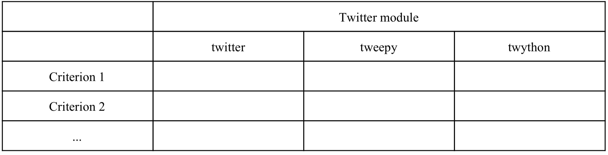

<h1>Sentiment Analysis: Using Twitter</h1>

<b>Task:</b> Your task (to be completed as a group assignment) is based on using different twitter modules available for Python. You are required to perform sentiment analysis for four swing states: Michigan, Nevada and Wisconsin, and one swing state of your choosing. . You need to accomplish this using three modules: <i>tweepy</i>,  <i>twython</i>, and <i>textblob</i>.

For parts 1 and 2 you need to provide a graphical output which looks like the following (the x axis represents sentiment score):


<b>Due date:</b> TBD

<b>Notes and clarifications:</b>
1. <i>textblob</i>  provides a sentiment score between -1 and 1. Transform that to a score between 0 and 100, where 0 maps to 50.
2. Before calculating the sentiment score you need to “clean” each tweet -- by getting rid of stop words, making everything lower case and getting rid of special characters (as we had done in class). Use the cleaned tweet to create the  <i>textblob</i>  object from which you calculate the sentiment score.
3. Collect a maximum of 1000 tweets for each category (candidate and state). You can use any mechanism to impose this limit - a common approach being to use the  `while`  loop and breaking out of it once the tweet count is satisfied.
4. One way to define the geography for tweets is to use the geolocation in your search. It is equally acceptable to choose a city in a state (e.g. Detroit in Michigan) to obtain your tweets.

<b>Deliverables:</b>
  - `part1_plot.png` & `part2_plot.png` plots

  - `part3_table.pdf` table

  - File(s) of your code

  - <b>Optional</b> for bonus `bonus_response.pdf`

<h3><b>Assignment:</b></h3>

<b>Part 1:</b> Tweepy

1. To complete task 1, you first need to install `tweepy` . To do that you need to have pip for Python 3 installed (Most of you already will by this point, but just in case.)

    ```
    sudo apt-get update
    sudo apt-get -y install python3-pip
    ```
2. Once you have done that, you install  <i>tweepy</i>  with the following

    ```
    command pip install <i>tweepy</i>
    ```

3. Use <i>tweepy</i> and the twitter search terms “Clinton” and “Trump” and the respective states (or the geolocation search option) to provide the required output.

4. Create a `matplotlib` plot similar to the one shown above and save it as `part1_plot.png`


<b>Part 2:</b> Twython

1. To complete task 2, you need to have installed  <i>twython</i>. I am assuming that you already have pip for Python 3 installed. Install  <i>twython</i>  with the following command:

2. Use  Use  <i>twython</i>   and the twitter search terms “Clinton” and “Trump” and the respective states (or the geolocation
search option) to provide the required output.

3. Create a `matplotlib` plot similar to the one shown above and save it as `part2_plot.png`

<b>Part 3:</b> Comparison

1. Compare the packages twitter, tweepy, and twython in a Table format, as follows. Please limit your response to 5 or fewer criteria. Provide proper attributions and references for your responses.

    

2. Submit a file `part3_table.pdf`

<b>Part 4:</b> Bonus

1. Explain what a streaming framework is and how it works (150 words max). Demonstrate the process / framework and provide the python code. Submit a pdf file named `bonus_response.pdf`

<b> Useful resources: </b>

-Tweepy:  [Link 1](https://media.readthedocs.org/pdf/tweepy/latest/tweepy.pdf), [Link 2](https://www.dataquest.io/blog/streaming-data-python/),  [Link 3](https://marcobonzanini.com/2015/03/02/) ,  [Link 4](https://www.youtube.com/watch?v=qZgx0pMR-Ps) ,  [Link 5](https://www.youtube.com/watch?v=o_OZdbCzHUA)

-Twython:  [Link 1](https://twython.readthedocs.io/en/latest/usage/basic_usage.html) ,  [Link 2](https://www.youtube.com/watch?v=7MVIfmjQERo) ,  [Link 3](https://www.linkedin.com/pulse/data-mining-using-twython-twitter-api-part-1-suran-kularatna,)

-Textblob:  [Link 1](https://github.com/praritlamba/Mining-Twitter-Data-for-Sentiment-Analysis) ,  [Link 2](http://tech.thejoestory.com/2015/01/python-textblob-sentiment-analysis.html)


<b>Grading Rubric:</b>


|    | Unsatisfactory | Satisfactory | Good | Excellent |
|:----------:|:-------------|:-------------| :-------------| :-------------|
| Delivery | ● Completed less than 70% of the requirements. <br> ● Not delivered on time or not in correct format (Blackboard or git) | ● Completed between 70-80% of the requirements. <br> ● Delivered on time, and in correct format (Blackboard or git)| ● Completed between 80-90% of the requirements. <br> ● Delivered on time, and in correct format (Blackboard or git)| ● Completed between 90-100% of the requirements. <br> ● Delivered on time, and in correct format (Blackboard or git) |
| Coding Standards | ● No name, date, or assignment title included <br> ● Poor use of white space (indentation, blank lines). <br> ● Disorganized and messy <br> ●Poor use of variables(many global variables, ambiguous naming). | ● Includes name, date, and assignment title. <br> ● White space makes program fairly easy to read.<br> ●Organized work. <br> ● Good use of variables (few global variables, unambiguous naming).| ●Includes name, date, and assignment title. <br> ●Good use of white space. <br> ● Organized work.<br> ●Good use of variables (no global variables, unambiguous naming) | ●Includes name, date, and assignment title. <br> ●Excellent use of white space. <br> ● Creatively organized work.<br> ●Excellent use of variables (no global variables, unambiguous naming). |
| Documentation | ● No documentation included. | ●Basic documentation has been completed including descriptions of all variables. <br> ●Purpose is noted for each function. | ● Clearly documented including descriptions of all variables. <br> ● Specific purpose is noted for each function and control structure.| ●Clearly and effectively documented including descriptions of all variables. <br> ●Specific purpose is noted for each function, control structure, input requirements, and output results. |
| Runtime | ●Does not execute due to errors. <br> ●User prompts are misleading or non-existent. <br> ● No testing has been completed.| ● Executes without errors(if applicable).<br> ● User prompts containlittle information, poordesign(if applicable).<br> ●Some testing has beencompleted.| ●Executes without errors <br> ●User prompts are understandable, minimum use of symbols or spacing in output(if applicable). <br> ● Thorough testing has been completed  | ●Executes without errors excellent. <br> ●user prompts, good use of symbols, spacing in output(if applicable). <br> ●Thorough and organized testing has been completed and output from test cases is included. |
| Efficiency | ●A difficult and inefficient solution. |  ●A logical solution that is easy to follow but it is not the most efficient. | ●Solution is efficient and easy to follow (i.e. no confusing tricks).| ●Solution is efficient, easy to understand, and maintain. |
